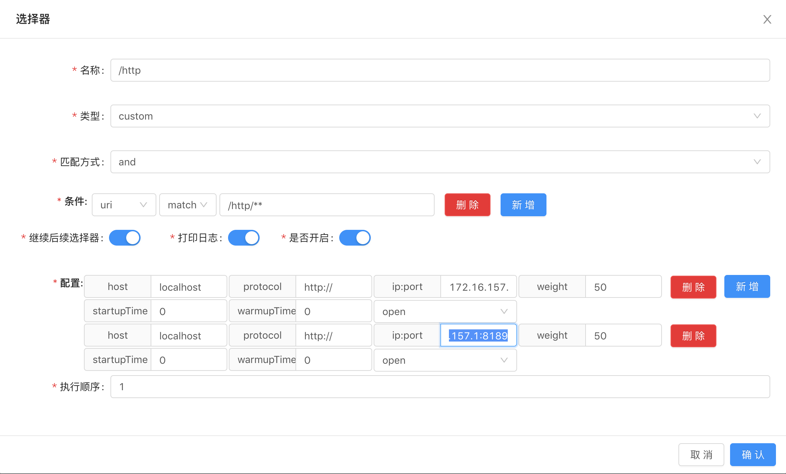

# soul-examples-http 体验

------

## 本节概述

- 熟悉 soul-examples-http 项目

## 主要内容

首先，补充上节中的一点遗漏，在运行 soul-examples 下的其他项目前，需要先将 soul-examples 转为 Maven Project ，具体操作为在 soul-examples 项目的 pom.xml 文件，右键选择 Add as Maven Project 后，等待编译完成即可。

### 运行 soul-examples-http

编译成功后，修改 soul-examples-http 项目配置文件 application.yml 中 http 的 adminUrl 配置，改为运行 soul-admin 项目的访问地址。

运行 SoulTestHttpApplication.java 启动项目。

```
2021-01-16 00:38:28.320  INFO 76846 --- [pool-1-thread-1] o.d.s.client.common.utils.RegisterUtils  : http client register success: {"appName":"http","context":"/http","path":"/http/test/**","pathDesc":"","rpcType":"http","host":"172.16.157.1","port":8188,"ruleName":"/http/test/**","enabled":true,"registerMetaData":false} 
2021-01-16 00:38:28.330  INFO 76846 --- [pool-1-thread-1] o.d.s.client.common.utils.RegisterUtils  : http client register success: {"appName":"http","context":"/http","path":"/http/order/save","pathDesc":"Save order","rpcType":"http","host":"172.16.157.1","port":8188,"ruleName":"/http/order/save","enabled":true,"registerMetaData":false} 
2021-01-16 00:38:28.338  INFO 76846 --- [pool-1-thread-1] o.d.s.client.common.utils.RegisterUtils  : http client register success: {"appName":"http","context":"/http","path":"/http/order/findById","pathDesc":"Find by id","rpcType":"http","host":"172.16.157.1","port":8188,"ruleName":"/http/order/findById","enabled":true,"registerMetaData":false} 
2021-01-16 00:38:28.344  INFO 76846 --- [pool-1-thread-1] o.d.s.client.common.utils.RegisterUtils  : http client register success: {"appName":"http","context":"/http","path":"/http/order/path/**","pathDesc":"","rpcType":"http","host":"172.16.157.1","port":8188,"ruleName":"/http/order/path/**","enabled":true,"registerMetaData":false} 
2021-01-16 00:38:28.351  INFO 76846 --- [pool-1-thread-1] o.d.s.client.common.utils.RegisterUtils  : http client register success: {"appName":"http","context":"/http","path":"/http/order/path/**/name","pathDesc":"","rpcType":"http","host":"172.16.157.1","port":8188,"ruleName":"/http/order/path/**/name","enabled":true,"registerMetaData":false} 
2021-01-16 00:38:28.430  INFO 76846 --- [           main] o.s.b.web.embedded.netty.NettyWebServer  : Netty started on port(s): 8188
2021-01-16 00:38:28.433  INFO 76846 --- [           main] o.d.s.e.http.SoulTestHttpApplication     : Started SoulTestHttpApplication in 1.46 seconds (JVM running for 1.944)
```

上节提到，当运行 soul-examples-http 项目后，可以在管理后台的插件列表菜单中的 divide ，看到如下图的选择器，那么选择器和选择器的规则是如何生成的呢？可以初步猜想是与注解 @SoulSpringMvcClient 有关。


该注解的作用告诉网关，哪些接口需要被网关代理，比如 OrderController.java 中出现的这些注解。

```java
@SoulSpringMvcClient(path = "/order")
@SoulSpringMvcClient(path = "/save" , desc = "Save order")
@SoulSpringMvcClient(path = "/findById", desc = "Find by id")
```

通过 soul-bootstrap 网关访问 soul-examples-http 项目，soul-bootstrap 项目的端口为9195，soul-examples-http 项目 配置的soul.http.contextPath 为 /http ，所以访问 http://localhost:9195/http/order/findById?id=3 ，响应结果符合预期。


可以通过日志看到请求转发到了8188端口

```
2021-01-16 00:40:42.979  INFO 76767 --- [-work-threads-1] o.d.soul.plugin.base.AbstractSoulPlugin  : divide selector success match , selector name :/http
2021-01-16 00:40:42.982  INFO 76767 --- [-work-threads-1] o.d.soul.plugin.base.AbstractSoulPlugin  : divide selector success match , selector name :/http/order/findById
2021-01-16 00:40:42.993  INFO 76767 --- [-work-threads-1] o.d.s.plugin.httpclient.WebClientPlugin  : The request urlPath is http://172.16.157.1:8188/order/findById?id=3, retryTimes is 0
```

同时，在管理后台的插件列表 -> divide 的配置中可以看到真实的请求地址。


下面我贴一下 soul-examples-http 项目中 OrderController.java 的 findById 接口代码：

```java
/**
 * Find by id order dto.
 * 
 * @param id the id
 * @return the order dto
*/
@GetMapping("/findById")
@SoulSpringMvcClient(path = "/findById", desc = "Find by id")
public OrderDTO findById(@RequestParam("id") final String id) {
    OrderDTO orderDTO = new OrderDTO();
    orderDTO.setId(id);
    orderDTO.setName("hello world findById");
    return orderDTO;
}
```

其中  `@SoulSpringMvcClient(path = "/findById", desc = "Find by id")`  这段代码的意思是将该接口映射到 Soul 网关的 path 为 /findById ，desc 表示此接口的描述信息是 Find by id 。

配置文件 application.yml 中的 soul.http.adminUrl 表示注册在管理后台的地址，soul.http.port 和 soul.http.contextPath 表示的是 Soul 网关接收到以 contextPath 开头的 URL ，要转发到 port 端口去。

接下来，我们启动2个 http 服务实例并通过配置权重值 weight 来测试一下网关负载均衡转发 http 请求的功能， 

首先，先设置 IDEA 可以启动多个服务，勾选 Allow parallel run ，点击 Apply 保存设置。


然后，修改 application.yml 如下：

```yaml
server:
  port: 8189
  address: 0.0.0.0


soul:
  http:
    adminUrl: http://localhost:9095
    port: 8189
    contextPath: /http
    appName: http
    full: false
```

可以通过控制台日志看到，我们已经启动成功，端口号是8189。

```
2021-01-16 00:47:13.007  INFO 77384 --- [pool-1-thread-1] o.d.s.client.common.utils.RegisterUtils  : http client register success: {"appName":"http","context":"/http","path":"/http/test/**","pathDesc":"","rpcType":"http","host":"172.16.157.1","port":8189,"ruleName":"/http/test/**","enabled":true,"registerMetaData":false} 
2021-01-16 00:47:13.021  INFO 77384 --- [pool-1-thread-1] o.d.s.client.common.utils.RegisterUtils  : http client register success: {"appName":"http","context":"/http","path":"/http/order/save","pathDesc":"Save order","rpcType":"http","host":"172.16.157.1","port":8189,"ruleName":"/http/order/save","enabled":true,"registerMetaData":false} 
2021-01-16 00:47:13.032  INFO 77384 --- [pool-1-thread-1] o.d.s.client.common.utils.RegisterUtils  : http client register success: {"appName":"http","context":"/http","path":"/http/order/findById","pathDesc":"Find by id","rpcType":"http","host":"172.16.157.1","port":8189,"ruleName":"/http/order/findById","enabled":true,"registerMetaData":false} 
2021-01-16 00:47:13.042  INFO 77384 --- [pool-1-thread-1] o.d.s.client.common.utils.RegisterUtils  : http client register success: {"appName":"http","context":"/http","path":"/http/order/path/**","pathDesc":"","rpcType":"http","host":"172.16.157.1","port":8189,"ruleName":"/http/order/path/**","enabled":true,"registerMetaData":false} 
2021-01-16 00:47:13.051  INFO 77384 --- [pool-1-thread-1] o.d.s.client.common.utils.RegisterUtils  : http client register success: {"appName":"http","context":"/http","path":"/http/order/path/**/name","pathDesc":"","rpcType":"http","host":"172.16.157.1","port":8189,"ruleName":"/http/order/path/**/name","enabled":true,"registerMetaData":false} 
2021-01-16 00:47:13.169  INFO 77384 --- [           main] o.s.b.web.embedded.netty.NettyWebServer  : Netty started on port(s): 8189
2021-01-16 00:47:13.172  INFO 77384 --- [           main] o.d.s.e.http.SoulTestHttpApplication     : Started SoulTestHttpApplication in 1.239 seconds (JVM running for 2.731)
```

此时，我们可以在管理后台中看到 divide 插件下 /http 选择器下多了一条我们新启动的配置，如下图：



选择器配置中，custom 是自定义流量，full 是全流量。自定义流量就是请求会走你下面的匹配方式与条件。全流量则不走。

修改一下权重值 weight ，8188端口为100，8189端口为50，测试可得转发到8188的请求数大于8189端口的请求数。

```
2021-01-16 00:54:02.324  INFO 76767 --- [work-threads-15] o.d.soul.plugin.base.AbstractSoulPlugin  : divide selector success match , selector name :/http
2021-01-16 00:54:02.324  INFO 76767 --- [work-threads-15] o.d.soul.plugin.base.AbstractSoulPlugin  : divide selector success match , selector name :/http/order/findById
2021-01-16 00:54:02.324  INFO 76767 --- [work-threads-15] o.d.s.plugin.httpclient.WebClientPlugin  : The request urlPath is http://172.16.157.1:8188/order/findById?id=3, retryTimes is 0
2021-01-16 00:54:03.060  INFO 76767 --- [work-threads-17] o.d.soul.plugin.base.AbstractSoulPlugin  : divide selector success match , selector name :/http
2021-01-16 00:54:03.060  INFO 76767 --- [work-threads-17] o.d.soul.plugin.base.AbstractSoulPlugin  : divide selector success match , selector name :/http/order/findById
2021-01-16 00:54:03.060  INFO 76767 --- [work-threads-17] o.d.s.plugin.httpclient.WebClientPlugin  : The request urlPath is http://172.16.157.1:8188/order/findById?id=3, retryTimes is 0
2021-01-16 00:54:03.798  INFO 76767 --- [work-threads-19] o.d.soul.plugin.base.AbstractSoulPlugin  : divide selector success match , selector name :/http
2021-01-16 00:54:03.799  INFO 76767 --- [work-threads-19] o.d.soul.plugin.base.AbstractSoulPlugin  : divide selector success match , selector name :/http/order/findById
2021-01-16 00:54:03.799  INFO 76767 --- [work-threads-19] o.d.s.plugin.httpclient.WebClientPlugin  : The request urlPath is http://172.16.157.1:8188/order/findById?id=3, retryTimes is 0
2021-01-16 00:54:04.489  INFO 76767 --- [work-threads-21] o.d.soul.plugin.base.AbstractSoulPlugin  : divide selector success match , selector name :/http
2021-01-16 00:54:04.489  INFO 76767 --- [work-threads-21] o.d.soul.plugin.base.AbstractSoulPlugin  : divide selector success match , selector name :/http/order/findById
2021-01-16 00:54:04.489  INFO 76767 --- [work-threads-21] o.d.s.plugin.httpclient.WebClientPlugin  : The request urlPath is http://172.16.157.1:8189/order/findById?id=3, retryTimes is 0
2021-01-16 00:54:04.491  WARN 76767 --- [work-threads-21] io.netty.bootstrap.Bootstrap             : Unknown channel option 'SO_TIMEOUT' for channel '[id: 0x8cbfba0a]'
2021-01-16 00:54:05.377  INFO 76767 --- [work-threads-23] o.d.soul.plugin.base.AbstractSoulPlugin  : divide selector success match , selector name :/http
2021-01-16 00:54:05.378  INFO 76767 --- [work-threads-23] o.d.soul.plugin.base.AbstractSoulPlugin  : divide selector success match , selector name :/http/order/findById
2021-01-16 00:54:05.378  INFO 76767 --- [work-threads-23] o.d.s.plugin.httpclient.WebClientPlugin  : The request urlPath is http://172.16.157.1:8189/order/findById?id=3, retryTimes is 0
2021-01-16 00:54:26.635  INFO 76767 --- [work-threads-25] o.d.soul.plugin.base.AbstractSoulPlugin  : divide selector success match , selector name :/http
2021-01-16 00:54:26.635  INFO 76767 --- [work-threads-25] o.d.soul.plugin.base.AbstractSoulPlugin  : divide selector success match , selector name :/http/order/findById
2021-01-16 00:54:26.635  INFO 76767 --- [work-threads-25] o.d.s.plugin.httpclient.WebClientPlugin  : The request urlPath is http://172.16.157.1:8188/order/findById?id=3, retryTimes is 0
```

接下来我们结合官方文档了解一下配置中的其他项：

选择器详解：

- 名称：为你的选择器起一个容易分辨的名字

- 类型：`custom flow` 是自定义流量。`full flow` 是全流量。自定义流量就是请求会走你下面的匹配方式与条件。全流量则不走。

- 匹配方式：`and` 或者 `or` 是指下面多个条件是按照 `and` 还是 `or` 的方式来组合。

- 条件：

    - uri：是指你根据 `uri` 的方式来筛选流量，`match` 的方式支持模糊匹配（/**）
    - header：是指根据请求头里面的字段来筛选流量。
    - query：是指根据 `uri` 的查询条件来进行筛选流量。
    - ip：是指根据你请求的真实 `ip` ，来筛选流量。
    - host：是指根据你请求的真实 `host` ，来筛选流量。
    - post：建议不要使用。
    - 条件匹配：
        - match：模糊匹配，建议和 `uri` 条件搭配，支持 restful 风格的匹配。（/test/**）
        - =：前后值相等，才能匹配。
        - regEx：正则匹配，表示前面一个值去匹配后面的正则表达式。
        - like：字符串模糊匹配。

- 是否开启：打开才会生效

- 打印日志：打开的时候，当匹配上的时候，会打印匹配日志。

- 执行顺序：当多个选择器的时候，执行顺序小的优先执行。

    选择器建议：可以 `uri` 条件， `match` 前缀 （/contextPath），进行第一道流量筛选。

规则详解：

- 当流量经过选择器匹配成功之后，会进入规则来进行最终的流量匹配。
- 规则是对流量最终执行逻辑的确认。
- 规则详解：
    - 名称：为你的规则起一个容易分辨的名字
    - 匹配方式：and 或者or 是指下面多个条件是按照and 还是or。
    - 条件：
        - uri：是指你根据 `uri` 的方式来筛选流量，`match` 的方式支持模糊匹配（/**）
        - header：是指根据请求头里面的字段来筛选流量。
        - query：是指根据 `uri` 的查询条件来进行筛选流量。
        - ip：是指根据你请求的真实 `ip` ，来筛选流量。
        - host：是指根据你请求的真实 `host` ，来筛选流量。
        - post：建议不要使用。
        - 条件匹配：
            - match：模糊匹配，建议和 `uri` 条件搭配，支持 restful 风格的匹配。（/test/**）
            - =：前后值相等，才能匹配。
            - regEx：正则匹配，表示前面一个值去匹配后面的正则表达式。
            - like：字符串模糊匹配。
    - 是否开启：打开才会生效。
    - 打印日志：打开的时候，当匹配上的时候，会打印匹配日志。
    - 执行顺序：当多个选择器的时候，执行顺序小的优先执行。
    - 处理：每个插件的规则处理不一样，具体的差有具体的处理，具体请查看每个对应插件的处理。

选择器配置到此处，我尝试简单的深入了解一下 divide 插件的源码，找到 soul-plugin -> Soul-plugin-divide 项目 handler 包下的 DividePluginDataHandler.java，Debug跟了一下。

当 soul-bootstrap 项目启动时和选择器保存操作时，都会进入 handlerSelector 这个方法中。

```java
@Override
public void handlerSelector(final SelectorData selectorData) {
    UpstreamCacheManager.getInstance().submit(selectorData);
}
```

submit 方法

```java
public void submit(final SelectorData selectorData) {
    final List<DivideUpstream> upstreamList = GsonUtils.getInstance().fromList(selectorData.getHandle(), DivideUpstream.class);
    if (null != upstreamList && upstreamList.size() > 0) {
        UPSTREAM_MAP.put(selectorData.getId(), upstreamList);
        UPSTREAM_MAP_TEMP.put(selectorData.getId(), upstreamList);
    } else {
        UPSTREAM_MAP.remove(selectorData.getId());
        UPSTREAM_MAP_TEMP.remove(selectorData.getId());
    }
}
```


## 问题记录

关于选择器的配置中的执行顺序这一项，我一直都没理解该如何测试才能体现出文档中提到的当多个选择器的时候，执行顺序小的优先执行。

## 知识拓展

### 相关文章推荐

### 知识点拓展

